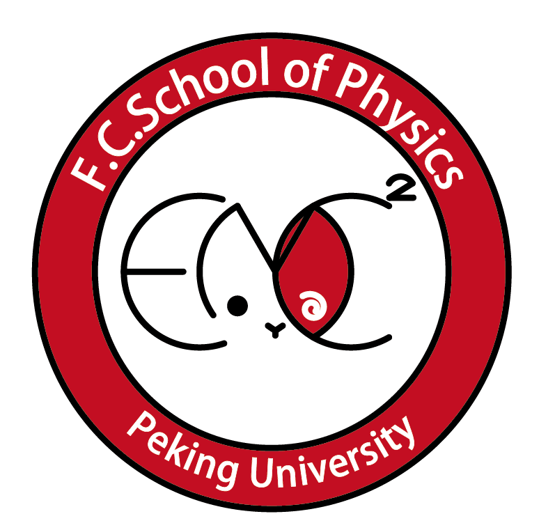

<a href="index.html">English</a> 中文

## 物理学院足球队
---
### 我们是谁？

    

我们是北京大学物理学院足球队。我们是北大足坛的一支劲旅，近年来坚持着传控打法，是长传冲吊居多的北大足坛中的一股清流。我们常年占据北大杯八强的一席，去年更是闯入了半决赛。

---
### 加入我们

我们欢迎所有物理学院喜爱足球的本科生和研究生参与。我们**每周五下午**会在**第一体育场**进行例行训练，**在开学的第一周周五会进行新生的试训**。

**想加入物院足球队，请联系领队陈跃元（微信号：RobbieCyy）。**
